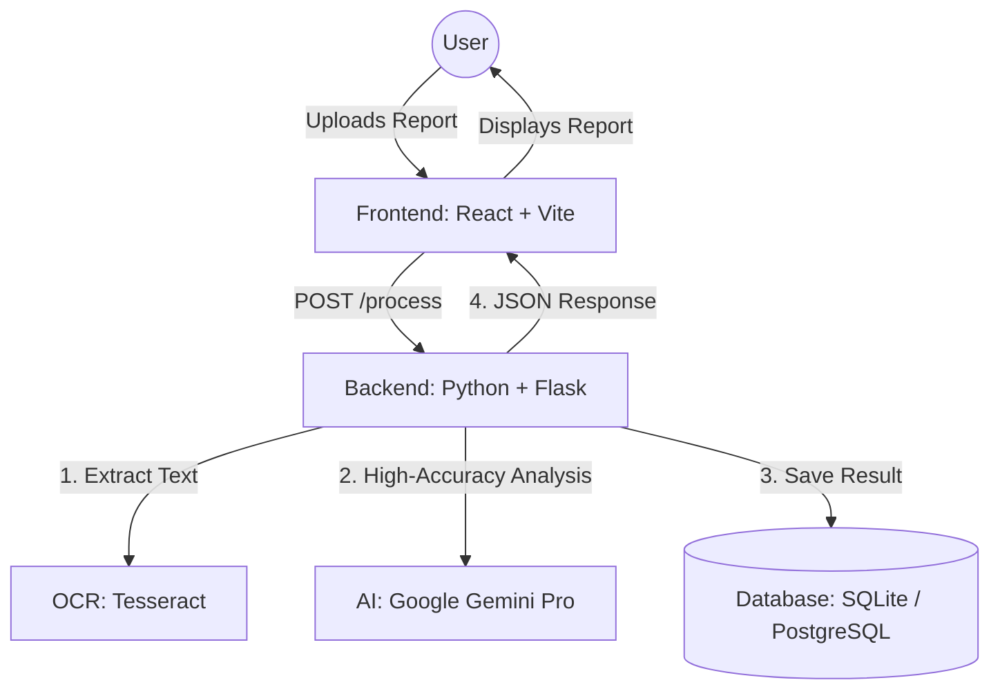

# 🩺 AI Medical Assistant: Developer Handbook

Welcome to the **AI Medical Assistant** project! This document is designed for developers and colleagues to understand how the system works, how to set it up, and how to contribute to its growth.

---

## 1. Project Overview
The AI Medical Assistant is a professional tool that helps bridge the communication gap between doctors and patients. It processes medical reports (PDFs/Images) and uses advanced AI to extract clinical data and simplify it for patients.

### Core Value Props:
- **Instant Medical Summaries**: Professional summaries for doctors.
- **Patient Simplification**: Translates complex medical jargon into easy-to-understand language (Arabic/English).
- **History Tracking**: Saves every report for future reference.

---

## 2. System Architecture

The project follows a modern decoupled architecture:



---

## 3. Step-by-Step Setup

### Prerequisites:
- Python 3.9+
- Node.js 18+
- Tesseract OCR (`brew install tesseract` on Mac)

### Step 1: Backend Setup
```bash
cd back-end
python -m venv .venv
source .venv/bin/activate
pip install -r requirements.txt
```

### Step 2: Environment Configuration
Create a `.env` file in the `back-end/` folder:
```env
GEMINI_API_KEY=your_key_here
DATABASE_URL=sqlite:///instance/ai_medical.db  # Use postgresql:// for cloud
```

### Step 3: Frontend Setup
```bash
cd frontend
npm install
npm run dev
```

---

## 4. The Processing Pipeline (The "Magic")

When a file is uploaded, the following happens in `main.py`:

1.  **Extraction**: `pdf_to_text()` or `image_to_text()` uses Tesseract to get raw text.
2.  **Logic**: `analyze_with_gemini()` sends the text to Google Gemini Pro with a specialized medical prompt.
3.  **Persistence**: The result is saved to the `Report` table in the database.
4.  **Translation**: If needed, the summary is translated via `translate_text()`.

---

## 5. Database Schema
We use **SQLAlchemy** for flexibility.
- **User**: Handles authentication and roles (Doctor/Patient).
- **Report**: Stores `patient_name`, `original_text`, `summary`, `vitals` (JSON), and `entities` (JSON).

---

## 6. How to Contribute
- **Accuracy**: Improve the prompt in `analyze_with_gemini` to get better clinical data.
- **UI**: Add new visualizations for vitals (charts) in the `History` page.
- **Security**: Strengthen the JWT authentication logic in the backend.

---

## 7. Useful Commands
- **Start Backend**: `python back-end/app/main.py`
- **Clean Temp Files**: The app automatically sweeps `tmp/` folders after processing.
- **Test Backend**: `pytest` (coming soon).

---
*Created by Antigravity AI for the Medical Assistant Team.*
